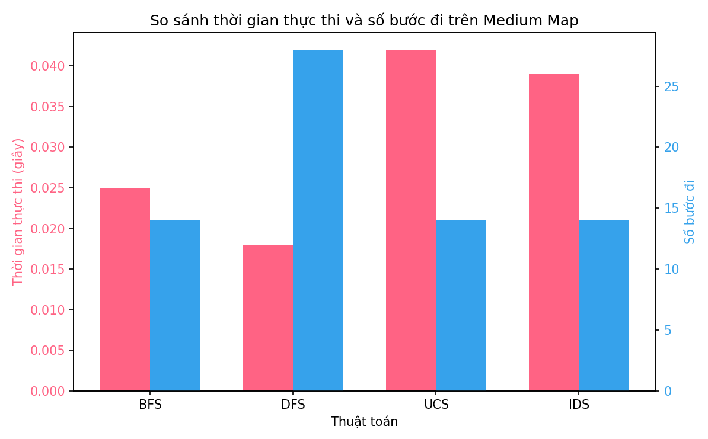
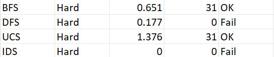
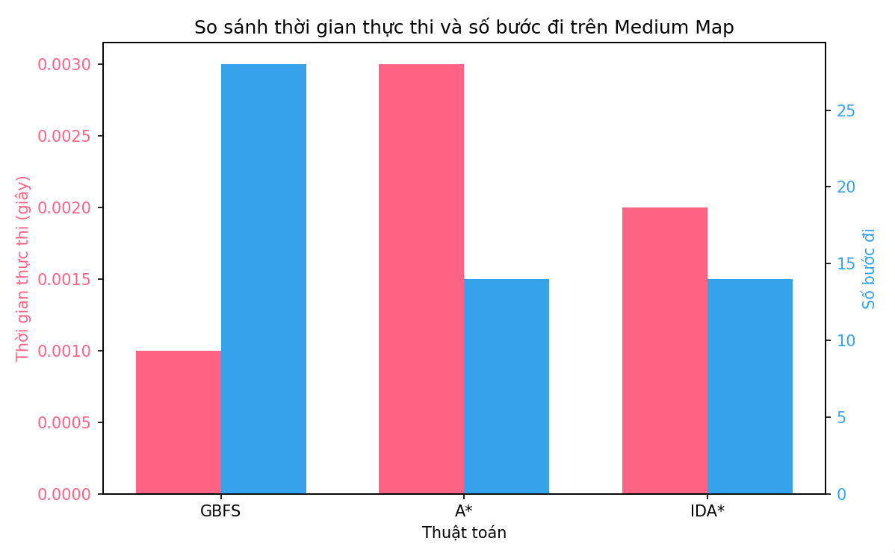

# Báo cáo cá nhân 
Họ tên: Nguyễn Thanh Trúc
MSSV: 23133080
Môn học: Trí tuệ nhân tạo
 ## 1. Mục tiêu
Mục tiêu của chương trình là mô phỏng và so sánh hiệu suất các thuật toán tìm kiếm không có thông tin (uninformed search) trong việc giải bài toán 8-Puzzle, với trọng tâm là Medium Map ([1, 2, 3, 4, 0, 5, 6, 7, 8]) để đánh giá hiệu quả trên trường hợp tiêu chuẩn. Easy Map ([1, 2, 3, 4, 5, 6, 0, 7, 8]) được sử dụng để kiểm tra khả năng hoạt động của các thuật toán, đặc biệt là những thuật toán không tối ưu cho 8-Puzzle. Hard Map ([8, 6, 7, 2, 5, 4, 3, 0, 1]) được bổ sung để thử nghiệm tính phù hợp của các thuật toán uninformed search với bài toán 8-Puzzle, đồng thời đánh giá khả năng xử lý trên các map khó với độ sâu giải pháp lớn hơn (khoảng 20 bước). Chương trình:
- Triển khai các thuật toán uninformed search (BFS, DFS, UCS, IDS) để giải bài toán 8-Puzzle.
- Ghi lại kết quả thực thi (thời gian, số bước, trạng thái) vào file results.csv.
- Mô tả cách mỗi thuật toán giải quyết vấn đề (solution) thông qua cơ chế và đặc điểm.
- So sánh hiệu suất trên Medium Map, đồng thời kiểm tra khả năng xử lý Easy Map và Hard Map.

## 2. Nội dung
### 2.1. Uninformed Search
#### Thành phần chính:
Các thuật toán tìm kiếm không có thông tin (uninformed search) là những phương pháp tìm kiếm không sử dụng thông tin heuristic, chỉ dựa trên cấu trúc không gian trạng thái và các quy tắc di chuyển hợp lệ trong bài toán 8-Puzzle. Nhóm này bao gồm:
- Breadth-First Search (BFS): Khám phá trạng thái theo mức độ sâu.
- Depth-First Search (DFS): Khám phá một nhánh đến độ sâu tối đa.
- Uniform Cost Search (UCS): Mở rộng trạng thái có chi phí thấp nhất.
- Iterative Deepening Search (IDS): Kết hợp BFS và DFS với độ sâu tăng dần.
#### Cách các thuật toán Uniformed Search giải quyết vấn đề
1. Breadth-First Search (BFS):
    - Cơ chế: Sử dụng hàng đợi (queue) để khám phá tất cả trạng thái ở một mức độ sâu trước khi chuyển sang mức sâu hơn. BFS duyệt qua các trạng thái gần trạng thái ban đầu trước, đảm bảo tìm được đường đi ngắn nhất đến đích.
    - Đặc điểm: Luôn tạo ra giải pháp tối ưu (đường đi ngắn nhất), nhưng yêu cầu bộ nhớ lớn để lưu trữ các trạng thái trong hàng đợi. Phù hợp với Medium map do không gian trạng thái không quá lớn.
2. Depth-First Search (DFS):
    - Cơ chế: Sử dụng ngăn xếp (stack) để khám phá một nhánh đến độ sâu tối đa (giới hạn tại max_depth=30 trong mã) trước khi quay lại (backtrack) để thử nhánh khác.
    - Đặc điểm: Tiết kiệm bộ nhớ vì chỉ lưu một nhánh tại một thời điểm, nhưng giải pháp không đảm bảo tối ưu và có thể thất bại trên Medium map nếu nhánh sâu không dẫn đến đích. Trên Easy map, DFS thường thành công nhanh do độ sâu nhỏ.
3. Uniform Cost Search (UCS):
    - Cơ chế: Sử dụng hàng đợi ưu tiên (priority queue) để mở rộng trạng thái có chi phí thấp nhất (số bước di chuyển). Trong 8-Puzzle, do chi phí đồng đều, UCS hoạt động tương tự BFS.
    - Đặc điểm: Giải pháp tối ưu, nhưng yêu cầu bộ nhớ lớn tương tự BFS. Hiệu quả trên Medium map do số bước cần thiết nhỏ.
4. Iterative Deepening Search (IDS):
    - Cơ chế: Chạy DFS nhiều lần với độ sâu tăng dần, kết hợp tính tối ưu của BFS và tiết kiệm bộ nhớ của DFS. Mỗi lần lặp, IDS khám phá các trạng thái đến một độ sâu nhất định trước khi tăng giới hạn.
    - Đặc điểm: Giải pháp tối ưu, tiết kiệm bộ nhớ hơn BFS, nhưng thời gian thực thi dài hơn do lặp lại các trạng thái ở độ sâu thấp hơn. Phù hợp cho cả Medium và Easy map.
#### So sánh hiệu suất:
1. BFS:

2. DFS:

3. UCS:

4. IDS:

##### Biểu đồ so sánh hiệu suất:

#### Nhận xét hiệu suất:
- DFS: 
    - Điểm mạnh: Nhanh nhất về thời gian (0.018s), phù hợp với lý thuyết rằng DFS có thể nhanh nếu nhánh chứa giải pháp được chọn sớm. DFS tiết kiệm bộ nhớ nhờ chỉ lưu một nhánh tại một thời điểm.
    - Điểm yếu: Số bước đi cao (28), gấp đôi các thuật toán khác, cho thấy DFS không tối ưu trong trường hợp này. Điều này có thể do nhánh được chọn không phải là đường đi ngắn nhất.
- BFS: 
    - Điểm mạnh: Số bước đi tối ưu (14), đúng với lý thuyết rằng BFS đảm bảo tìm đường đi ngắn nhất trong bài toán 8-Puzzle. Thời gian thực thi (0.025s) là hợp lý, nhanh hơn UCS và IDS.
    - Điểm yếu: Chậm hơn DFS (0.018s), do phải khám phá toàn bộ các mức độ sâu, dẫn đến yêu cầu bộ nhớ lớn hơn.
- UCS: 
    - Điểm mạnh: Số bước đi tối ưu (14), phù hợp với lý thuyết rằng UCS đảm bảo đường đi ngắn nhất trong các bài toán có chi phí đồng đều như 8-Puzzle.
    - Điểm yếu: Thời gian thực thi cao nhất (0.042s), chậm hơn nhiều so với DFS và BFS. UCS yêu cầu bộ nhớ lớn do sử dụng hàng đợi ưu tiên để quản lý các trạng thái.
- IDS: 
    - Điểm mạnh: Số bước đi tối ưu (14), tiết kiệm bộ nhớ hơn BFS và UCS nhờ lặp lại với độ sâu tăng dần. IDS là lựa chọn tốt khi cần cân bằng giữa tính tối ưu và yêu cầu bộ nhớ.
    - Điểm yếu: Thời gian thực thi cao (0.039s), do phải lặp lại việc khám phá trạng thái ở các độ sâu thấp hơn, khiến nó chậm hơn DFS và BFS.
- Tổng kết:
    - Trên Medium map: DFS nhanh nhất (0.018s), nhưng số bước đi cao (28), không tối ưu. BFS, UCS, và IDS đều đạt số bước tối ưu (14), với BFS có thời gian thực thi tốt hơn (0.025s) so với UCS (0.042s) và IDS (0.039s).
    - Đề xuất: Nếu ưu tiên tốc độ, DFS là lựa chọn tốt nhất trên Medium map, nhưng cần lưu ý tính không ổn định về số bước. Nếu cần đường đi tối ưu, BFS là phù hợp hơn, đặc biệt khi tài nguyên hệ thống đủ lớn. IDS là lựa chọn cân bằng khi cần tiết kiệm bộ nhớ mà vẫn đảm bảo tính tối ưu.
#### Chạy thử với Hard Map

Kết quả chạy thử trên Hard Map ([8, 6, 7, 2, 5, 4, 3, 0, 1]) cho thấy BFS và UCS thành công với thời gian lần lượt là 0.651s và 1.376s, cả hai đều tìm được giải pháp tối ưu với 31 bước. Tuy nhiên, DFS thất bại (0.177s, 0 bước) do giới hạn độ sâu không đủ để tìm giải pháp, trong khi IDS không chạy được (0.000s, 0 bước) có thể do lỗi triển khai hoặc giới hạn thời gian, làm nổi bật sự vượt trội của BFS và UCS trong các trường hợp phức tạp, dù yêu cầu tài nguyên cao. 

### 2.2. Informed Search
#### Thành phần chính
Các thuật toán tìm kiếm có thông tin (informed search) sử dụng thông tin heuristic để định hướng quá trình khám phá không gian trạng thái, giúp tìm giải pháp hiệu quả hơn so với các thuật toán không có thông tin (uninformed search). Trong bài toán 8-Puzzle, các thuật toán này dựa vào hàm đánh giá (heuristic function) để ưu tiên các trạng thái hứa hẹn dẫn đến trạng thái đích ([1, 2, 3, 4, 5, 6, 7, 8, 0]). Các thuật toán chính bao gồm:
- A Star Search (A)**: Kết hợp chi phí đã đi (g(n)) và chi phí ước lượng đến đích (h(n)) để tìm đường đi tối ưu.
- Greedy Best-First Search (GBFS): Ưu tiên trạng thái dựa trên heuristic (h(n)) mà không xét chi phí đã đi, không đảm bảo tối ưu.
- IDS Star Search: Kết hợp tính tối ưu của A* với tiết kiệm bộ nhớ của Iterative Deepening Search (IDS), sử dụng ngưỡng (threshold) để giới hạn độ sâu khám phá.
#### Cách các thuật toán Informed Search giải quyết vấn đề
1. A Star Search(A)**:
    - Cơ chế: Sử dụng hàm đánh giá f(n) = g(n) + h(n), trong đó g(n) là chi phí từ trạng thái ban đầu đến trạng thái hiện tại (số bước đã đi), và h(n) là heuristic ước lượng chi phí từ trạng thái hiện tại đến đích. A* khám phá trạng thái có f(n) nhỏ nhất bằng hàng đợi ưu tiên, đảm bảo tìm đường đi tối ưu nếu heuristic thỏa mãn điều kiện admissible và consistent.
    - Đặc điểm: Đảm bảo giải pháp tối ưu, nhưng yêu cầu bộ nhớ lớn (O(b^d)) và thời gian phụ thuộc vào chất lượng heuristic. Phù hợp với Medium Map nếu heuristic tốt (ví dụ: khoảng cách Manhattan).
2. Greedy Best-First Search (GBFS):
    - Cơ chế: Ưu tiên trạng thái dựa trên h(n) mà không xét g(n), sử dụng hàng đợi ưu tiên để chọn trạng thái có heuristic thấp nhất. GBFS nhắm đến trạng thái gần đích nhất theo ước lượng, nhưng không đảm bảo tối ưu.
    - Đặc điểm: Nhanh hơn A* vì bỏ qua chi phí đã đi, nhưng có thể tạo đường đi dài hơn hoặc thất bại nếu heuristic không dẫn đúng hướng. Tiết kiệm bộ nhớ hơn A* trong một số trường hợp.
3. IDA Star Search:
    -Cơ chế: Sử dụng một ngưỡng (threshold) ban đầu bằng giá trị heuristic của trạng thái ban đầu (h(n)), sau đó lặp lại quá trình tìm kiếm giống DFS với ngưỡng này. Trong mỗi lần lặp, IDA* khám phá các trạng thái có f(n) = g(n) + h(n) nhỏ hơn hoặc bằng ngưỡng, với g(n) là số bước đã đi và h(n) là heuristic. Nếu không tìm thấy giải pháp, ngưỡng được cập nhật thành giá trị f(n) nhỏ nhất vượt ngưỡng, và quá trình lặp lại cho đến khi tìm được giải pháp. Code sử dụng tập visited để tránh lặp lại trạng thái, nhưng xóa trạng thái sau mỗi nhánh để tiết kiệm bộ nhớ.
    - Đặc điểm: Đảm bảo giải pháp tối ưu nếu heuristic admissible, kết hợp ưu điểm tiết kiệm bộ nhớ của DFS (O(m), với m là độ sâu tối đa) và tính tối ưu của A*. Tuy nhiên, thời gian thực thi có thể dài do lặp lại nhiều lần, đặc biệt nếu không gian trạng thái lớn hoặc heuristic không hiệu quả.
#### So sánh hiệu suất
1. A Star:

2. Greedy Best-First Search:

3. IDA Star Search:

##### Biểu đồ so sánh hiệu suất:

#### Nhận xét:
- Greedy Best-First Search (GBFS): 
    - Điểm mạnh: Nhanh nhất về thời gian (0.001s), nhờ ưu tiên trạng thái dựa trên heuristic (h(n)) mà không xét chi phí đã đi (g(n)). Điều này giúp GBFS khám phá không gian trạng thái nhanh hơn trên Medium Map.
    - Điểm yếu: Số bước đi cao (28), gấp đôi A* và IDA*, cho thấy GBFS không đảm bảo tính tối ưu. Sự phụ thuộc vào chất lượng heuristic có thể dẫn đến đường đi dài hơn nếu heuristic không chính xác.
- A Search (A)**: 
    - Điểm mạnh: Số bước đi tối ưu (14), đúng với lý thuyết rằng A* đảm bảo đường đi ngắn nhất nhờ hàm đánh giá f(n) = g(n) + h(n) với heuristic admissible. Thời gian thực thi (0.003s) là chấp nhận được cho Medium Map.
    - Điểm yếu: Chậm hơn GBFS và IDA* do phải quản lý hàng đợi ưu tiên và khám phá toàn bộ các trạng thái có f(n) thấp, dẫn đến yêu cầu bộ nhớ lớn hơn.
- IDA Search (IDA)**: 
    - Điểm mạnh: Số bước đi tối ưu (14), kết hợp tính tối ưu của A* với tiết kiệm bộ nhớ của Iterative Deepening. Thời gian thực thi (0.002s) nhanh hơn A* và chỉ chậm hơn GBFS một chút, nhờ sử dụng ngưỡng (threshold) để giới hạn độ sâu khám phá.
    - Điểm yếu: Chậm hơn GBFS do lặp lại quá trình tìm kiếm với ngưỡng tăng dần, nhưng vẫn hiệu quả hơn A* về bộ nhớ trên Medium Map.
- Tổng kết:
    - Trên Medium Map: GBFS nổi bật về tốc độ (0.001s), nhưng không tối ưu về số bước (28). A* và IDA* đều đạt số bước tối ưu (14), với IDA* có thời gian thực thi tốt hơn A* (0.002s so với 0.003s), nhờ tiết kiệm bộ nhớ và chiến lược lặp lại ngưỡng.
    - Đề xuất: Nếu ưu tiên tốc độ, GBFS là lựa chọn tốt trên Medium Map. Nếu cần đường đi tối ưu, A* và IDA* đều phù hợp, với IDA* vượt trội khi tài nguyên bộ nhớ hạn chế.
#### Chạy thử với Hard Map

Kết quả chạy thử trên Hard Map ([8, 6, 7, 2, 5, 4, 3, 0, 1]) cho thấy GBFS nhanh nhất (0.001s) nhưng không tối ưu với 53 bước, trong khi A* (0.359s) và IDA* (0.126s) đều tìm được giải pháp tối ưu với 31 bước. GBFS phù hợp khi ưu tiên tốc độ, nhưng A* và IDA* vượt trội về tính tối ưu, với IDA* hiệu quả hơn A* nhờ tiết kiệm bộ nhớ và thời gian thực thi nhanh hơn trên Hard Map.
