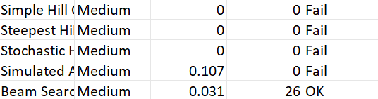
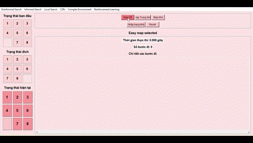
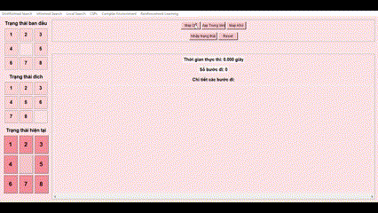
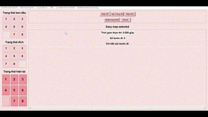
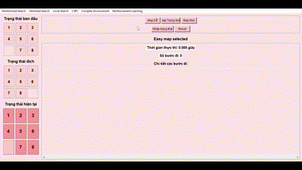
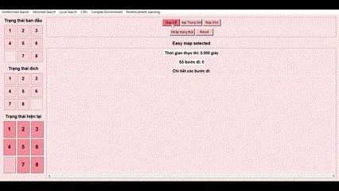
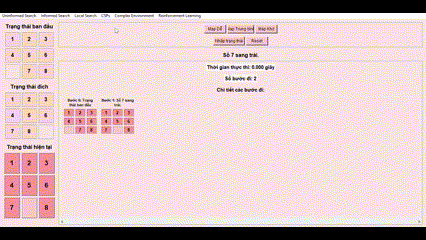
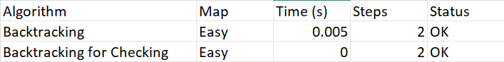
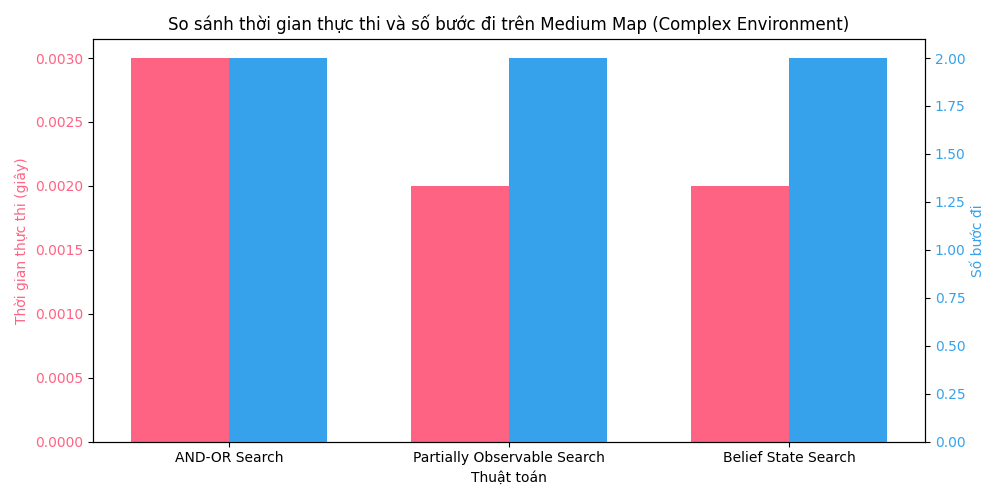

# Báo cáo cá nhân 
Họ tên: Nguyễn Thanh Trúc
MSSV: 23133080
Môn học: Trí tuệ nhân tạo
 ## 1. Mục tiêu
Mục tiêu của chương trình là mô phỏng và so sánh hiệu suất các thuật toán tìm kiếm không có thông tin (uninformed search) trong việc giải bài toán 8-Puzzle, với trọng tâm là Medium Map ([1, 2, 3, 4, 0, 5, 6, 7, 8]) để đánh giá hiệu quả trên trường hợp tiêu chuẩn. Easy Map ([1, 2, 3, 4, 5, 6, 0, 7, 8]) được sử dụng để kiểm tra khả năng hoạt động của các thuật toán, đặc biệt là những thuật toán không tối ưu cho 8-Puzzle. Hard Map ([8, 6, 7, 2, 5, 4, 3, 0, 1]) được bổ sung để thử nghiệm tính phù hợp của các thuật toán uninformed search với bài toán 8-Puzzle, đồng thời đánh giá khả năng xử lý trên các map khó với độ sâu giải pháp lớn hơn (khoảng 20 bước). Chương trình:
- Triển khai các thuật toán uninformed search (BFS, DFS, UCS, IDS) để giải bài toán 8-Puzzle.
- Ghi lại kết quả thực thi (thời gian, số bước, trạng thái) vào file results.csv.
- Mô tả cách mỗi thuật toán giải quyết vấn đề (solution) thông qua cơ chế và đặc điểm.
- So sánh hiệu suất trên Medium Map, đồng thời kiểm tra khả năng xử lý Easy Map và Hard Map.

## 2. Nội dung
### 2.1. Uninformed Search
#### Thành phần chính
Các thuật toán tìm kiếm không có thông tin (uninformed search) là những phương pháp tìm kiếm không sử dụng thông tin heuristic, chỉ dựa trên cấu trúc không gian trạng thái và các quy tắc di chuyển hợp lệ trong bài toán 8-Puzzle. Nhóm này bao gồm:
- Breadth-First Search (BFS): Khám phá trạng thái theo mức độ sâu.
- Depth-First Search (DFS): Khám phá một nhánh đến độ sâu tối đa.
- Uniform Cost Search (UCS): Mở rộng trạng thái có chi phí thấp nhất.
- Iterative Deepening Search (IDS): Kết hợp BFS và DFS với độ sâu tăng dần.
#### Cách các thuật toán Uniformed Search giải quyết vấn đề
1. Breadth-First Search (BFS):
    - Cơ chế: Sử dụng hàng đợi (queue) để khám phá tất cả trạng thái ở một mức độ sâu trước khi chuyển sang mức sâu hơn. BFS duyệt qua các trạng thái gần trạng thái ban đầu trước, đảm bảo tìm được đường đi ngắn nhất đến đích.
    - Đặc điểm: Luôn tạo ra giải pháp tối ưu (đường đi ngắn nhất), nhưng yêu cầu bộ nhớ lớn để lưu trữ các trạng thái trong hàng đợi. Phù hợp với Medium map do không gian trạng thái không quá lớn.
2. Depth-First Search (DFS):
    - Cơ chế: Sử dụng ngăn xếp (stack) để khám phá một nhánh đến độ sâu tối đa (giới hạn tại max_depth=30 trong mã) trước khi quay lại (backtrack) để thử nhánh khác.
    - Đặc điểm: Tiết kiệm bộ nhớ vì chỉ lưu một nhánh tại một thời điểm, nhưng giải pháp không đảm bảo tối ưu và có thể thất bại trên Medium map nếu nhánh sâu không dẫn đến đích. Trên Easy map, DFS thường thành công nhanh do độ sâu nhỏ.
3. Uniform Cost Search (UCS):
    - Cơ chế: Sử dụng hàng đợi ưu tiên (priority queue) để mở rộng trạng thái có chi phí thấp nhất (số bước di chuyển). Trong 8-Puzzle, do chi phí đồng đều, UCS hoạt động tương tự BFS.
    - Đặc điểm: Giải pháp tối ưu, nhưng yêu cầu bộ nhớ lớn tương tự BFS. Hiệu quả trên Medium map do số bước cần thiết nhỏ.
4. Iterative Deepening Search (IDS):
    - Cơ chế: Chạy DFS nhiều lần với độ sâu tăng dần, kết hợp tính tối ưu của BFS và tiết kiệm bộ nhớ của DFS. Mỗi lần lặp, IDS khám phá các trạng thái đến một độ sâu nhất định trước khi tăng giới hạn.
    - Đặc điểm: Giải pháp tối ưu, tiết kiệm bộ nhớ hơn BFS, nhưng thời gian thực thi dài hơn do lặp lại các trạng thái ở độ sâu thấp hơn. Phù hợp cho cả Medium và Easy map.
#### So sánh hiệu suất
1. BFS:

2. DFS:

3. UCS:

4. IDS:

##### Biểu đồ so sánh hiệu suất

#### Nhận xét hiệu suất
- DFS: 
    - Điểm mạnh: Nhanh nhất về thời gian (0.018s), phù hợp với lý thuyết rằng DFS có thể nhanh nếu nhánh chứa giải pháp được chọn sớm. DFS tiết kiệm bộ nhớ nhờ chỉ lưu một nhánh tại một thời điểm.
    - Điểm yếu: Số bước đi cao (28), gấp đôi các thuật toán khác, cho thấy DFS không tối ưu trong trường hợp này. Điều này có thể do nhánh được chọn không phải là đường đi ngắn nhất.
- BFS: 
    - Điểm mạnh: Số bước đi tối ưu (14), đúng với lý thuyết rằng BFS đảm bảo tìm đường đi ngắn nhất trong bài toán 8-Puzzle. Thời gian thực thi (0.025s) là hợp lý, nhanh hơn UCS và IDS.
    - Điểm yếu: Chậm hơn DFS (0.018s), do phải khám phá toàn bộ các mức độ sâu, dẫn đến yêu cầu bộ nhớ lớn hơn.
- UCS: 
    - Điểm mạnh: Số bước đi tối ưu (14), phù hợp với lý thuyết rằng UCS đảm bảo đường đi ngắn nhất trong các bài toán có chi phí đồng đều như 8-Puzzle.
    - Điểm yếu: Thời gian thực thi cao nhất (0.042s), chậm hơn nhiều so với DFS và BFS. UCS yêu cầu bộ nhớ lớn do sử dụng hàng đợi ưu tiên để quản lý các trạng thái.
- IDS: 
    - Điểm mạnh: Số bước đi tối ưu (14), tiết kiệm bộ nhớ hơn BFS và UCS nhờ lặp lại với độ sâu tăng dần. IDS là lựa chọn tốt khi cần cân bằng giữa tính tối ưu và yêu cầu bộ nhớ.
    - Điểm yếu: Thời gian thực thi cao (0.039s), do phải lặp lại việc khám phá trạng thái ở các độ sâu thấp hơn, khiến nó chậm hơn DFS và BFS.
- Tổng kết:
    - Trên Medium map: DFS nhanh nhất (0.018s), nhưng số bước đi cao (28), không tối ưu. BFS, UCS, và IDS đều đạt số bước tối ưu (14), với BFS có thời gian thực thi tốt hơn (0.025s) so với UCS (0.042s) và IDS (0.039s).
    - Đề xuất: Nếu ưu tiên tốc độ, DFS là lựa chọn tốt nhất trên Medium map, nhưng cần lưu ý tính không ổn định về số bước. Nếu cần đường đi tối ưu, BFS là phù hợp hơn, đặc biệt khi tài nguyên hệ thống đủ lớn. IDS là lựa chọn cân bằng khi cần tiết kiệm bộ nhớ mà vẫn đảm bảo tính tối ưu.
#### Chạy thử với Hard Map

Kết quả chạy thử trên Hard Map ([8, 6, 7, 2, 5, 4, 3, 0, 1]) cho thấy BFS và UCS thành công với thời gian lần lượt là 0.651s và 1.376s, cả hai đều tìm được giải pháp tối ưu với 31 bước. Tuy nhiên, DFS thất bại (0.177s, 0 bước) do giới hạn độ sâu không đủ để tìm giải pháp, trong khi IDS không chạy được (0.000s, 0 bước) có thể do lỗi triển khai hoặc giới hạn thời gian, làm nổi bật sự vượt trội của BFS và UCS trong các trường hợp phức tạp, dù yêu cầu tài nguyên cao. 

### 2.2. Informed Search
#### Thành phần chính
Các thuật toán tìm kiếm có thông tin (informed search) sử dụng thông tin heuristic để định hướng quá trình khám phá không gian trạng thái, giúp tìm giải pháp hiệu quả hơn so với các thuật toán không có thông tin (uninformed search). Trong bài toán 8-Puzzle, các thuật toán này dựa vào hàm đánh giá (heuristic function) để ưu tiên các trạng thái hứa hẹn dẫn đến trạng thái đích ([1, 2, 3, 4, 5, 6, 7, 8, 0]). Các thuật toán chính bao gồm:
- A Star Search (A)**: Kết hợp chi phí đã đi (g(n)) và chi phí ước lượng đến đích (h(n)) để tìm đường đi tối ưu.
- Greedy Best-First Search (GBFS): Ưu tiên trạng thái dựa trên heuristic (h(n)) mà không xét chi phí đã đi, không đảm bảo tối ưu.
- IDS Star Search: Kết hợp tính tối ưu của A* với tiết kiệm bộ nhớ của Iterative Deepening Search (IDS), sử dụng ngưỡng (threshold) để giới hạn độ sâu khám phá.
#### Cách các thuật toán Informed Search giải quyết vấn đề
1. A Star Search(A)**:
    - Cơ chế: Sử dụng hàm đánh giá f(n) = g(n) + h(n), trong đó g(n) là chi phí từ trạng thái ban đầu đến trạng thái hiện tại (số bước đã đi), và h(n) là heuristic ước lượng chi phí từ trạng thái hiện tại đến đích. A* khám phá trạng thái có f(n) nhỏ nhất bằng hàng đợi ưu tiên, đảm bảo tìm đường đi tối ưu nếu heuristic thỏa mãn điều kiện admissible và consistent.
    - Đặc điểm: Đảm bảo giải pháp tối ưu, nhưng yêu cầu bộ nhớ lớn (O(b^d)) và thời gian phụ thuộc vào chất lượng heuristic. Phù hợp với Medium Map nếu heuristic tốt (ví dụ: khoảng cách Manhattan).
2. Greedy Best-First Search (GBFS):
    - Cơ chế: Ưu tiên trạng thái dựa trên h(n) mà không xét g(n), sử dụng hàng đợi ưu tiên để chọn trạng thái có heuristic thấp nhất. GBFS nhắm đến trạng thái gần đích nhất theo ước lượng, nhưng không đảm bảo tối ưu.
    - Đặc điểm: Nhanh hơn A* vì bỏ qua chi phí đã đi, nhưng có thể tạo đường đi dài hơn hoặc thất bại nếu heuristic không dẫn đúng hướng. Tiết kiệm bộ nhớ hơn A* trong một số trường hợp.
3. IDA Star Search:
    -Cơ chế: Sử dụng một ngưỡng (threshold) ban đầu bằng giá trị heuristic của trạng thái ban đầu (h(n)), sau đó lặp lại quá trình tìm kiếm giống DFS với ngưỡng này. Trong mỗi lần lặp, IDA* khám phá các trạng thái có f(n) = g(n) + h(n) nhỏ hơn hoặc bằng ngưỡng, với g(n) là số bước đã đi và h(n) là heuristic. Nếu không tìm thấy giải pháp, ngưỡng được cập nhật thành giá trị f(n) nhỏ nhất vượt ngưỡng, và quá trình lặp lại cho đến khi tìm được giải pháp. Code sử dụng tập visited để tránh lặp lại trạng thái, nhưng xóa trạng thái sau mỗi nhánh để tiết kiệm bộ nhớ.
    - Đặc điểm: Đảm bảo giải pháp tối ưu nếu heuristic admissible, kết hợp ưu điểm tiết kiệm bộ nhớ của DFS (O(m), với m là độ sâu tối đa) và tính tối ưu của A*. Tuy nhiên, thời gian thực thi có thể dài do lặp lại nhiều lần, đặc biệt nếu không gian trạng thái lớn hoặc heuristic không hiệu quả.
#### So sánh hiệu suất
1. A Star:

2. Greedy Best-First Search:

3. IDA Star Search:

##### Biểu đồ so sánh hiệu suất

#### Nhận xét
- Greedy Best-First Search (GBFS): 
    - Điểm mạnh: Nhanh nhất về thời gian (0.001s), nhờ ưu tiên trạng thái dựa trên heuristic (h(n)) mà không xét chi phí đã đi (g(n)). Điều này giúp GBFS khám phá không gian trạng thái nhanh hơn trên Medium Map.
    - Điểm yếu: Số bước đi cao (28), gấp đôi A* và IDA*, cho thấy GBFS không đảm bảo tính tối ưu. Sự phụ thuộc vào chất lượng heuristic có thể dẫn đến đường đi dài hơn nếu heuristic không chính xác.
- A Search (A)**: 
    - Điểm mạnh: Số bước đi tối ưu (14), đúng với lý thuyết rằng A* đảm bảo đường đi ngắn nhất nhờ hàm đánh giá f(n) = g(n) + h(n) với heuristic admissible. Thời gian thực thi (0.003s) là chấp nhận được cho Medium Map.
    - Điểm yếu: Chậm hơn GBFS và IDA* do phải quản lý hàng đợi ưu tiên và khám phá toàn bộ các trạng thái có f(n) thấp, dẫn đến yêu cầu bộ nhớ lớn hơn.
- IDA Search (IDA)**: 
    - Điểm mạnh: Số bước đi tối ưu (14), kết hợp tính tối ưu của A* với tiết kiệm bộ nhớ của Iterative Deepening. Thời gian thực thi (0.002s) nhanh hơn A* và chỉ chậm hơn GBFS một chút, nhờ sử dụng ngưỡng (threshold) để giới hạn độ sâu khám phá.
    - Điểm yếu: Chậm hơn GBFS do lặp lại quá trình tìm kiếm với ngưỡng tăng dần, nhưng vẫn hiệu quả hơn A* về bộ nhớ trên Medium Map.
- Tổng kết:
    - Trên Medium Map: GBFS nổi bật về tốc độ (0.001s), nhưng không tối ưu về số bước (28). A* và IDA* đều đạt số bước tối ưu (14), với IDA* có thời gian thực thi tốt hơn A* (0.002s so với 0.003s), nhờ tiết kiệm bộ nhớ và chiến lược lặp lại ngưỡng.
    - Đề xuất: Nếu ưu tiên tốc độ, GBFS là lựa chọn tốt trên Medium Map. Nếu cần đường đi tối ưu, A* và IDA* đều phù hợp, với IDA* vượt trội khi tài nguyên bộ nhớ hạn chế.
#### Chạy thử với Hard Map

Kết quả chạy thử trên Hard Map ([8, 6, 7, 2, 5, 4, 3, 0, 1]) cho thấy GBFS nhanh nhất (0.001s) nhưng không tối ưu với 53 bước, trong khi A* (0.359s) và IDA* (0.126s) đều tìm được giải pháp tối ưu với 31 bước. GBFS phù hợp khi ưu tiên tốc độ, nhưng A* và IDA* vượt trội về tính tối ưu, với IDA* hiệu quả hơn A* nhờ tiết kiệm bộ nhớ và thời gian thực thi nhanh hơn trên Hard Map.

### 2.3. Local Search
#### Thành phần chính
Các thuật toán tìm kiếm cục bộ (local search) là các phương pháp tối ưu hóa tập trung vào việc cải thiện giải pháp hiện tại bằng cách khám phá các trạng thái lân cận, thay vì tìm kiếm toàn bộ không gian trạng thái như uninformed search hoặc informed search. Trong bài toán 8-Puzzle, local search không đảm bảo tìm giải pháp tối ưu nhưng thường nhanh và tiết kiệm bộ nhớ, phù hợp với các bài toán có không gian trạng thái lớn. Các thuật toán được triển khai bao gồm:
- Simple Hill Climbing: Chọn trạng thái lân cận đầu tiên cải thiện giá trị heuristic, dừng lại nếu không tìm thấy trạng thái tốt hơn.
- Steepest Ascent Hill Climbing: Chọn trạng thái lân cận có giá trị heuristic tốt nhất trong tất cả các nước đi có thể.
- Stochastic Hill Climbing: Chọn ngẫu nhiên một trạng thái lân cận cải thiện heuristic, với xác suất chọn ngẫu nhiên khi bị kẹt.
- Simulated Annealing: Sử dụng chiến lược ngẫu nhiên với nhiệt độ giảm dần để thoát khỏi cực trị cục bộ, với tham số tối ưu hóa chi tiết.
- Beam Search: Duy trì một tập hợp trạng thái (beam) với kích thước cố định, chọn các trạng thái tốt nhất để mở rộng tại mỗi bước.

#### Cách các thuật toán Local Search giải quyết vấn đề
1. Simple Hill Climbing:
    - Cơ chế: Bắt đầu từ trạng thái ban đầu, thuật toán kiểm tra các trạng thái lân cận (các trạng thái có thể đạt được bằng một bước di chuyển hợp lệ) và chọn trạng thái đầu tiên có giá trị heuristic (h(n)) nhỏ hơn trạng thái hiện tại. Quá trình lặp lại với giới hạn tối đa 1000 lần lặp, dừng lại nếu không tìm thấy trạng thái lân cận tốt hơn (cực trị cục bộ) hoặc đạt trạng thái đích.
    - Đặc điểm: Rất nhanh và tiết kiệm bộ nhớ (chỉ lưu trạng thái hiện tại và lân cận, O(1)), nhưng dễ bị kẹt ở cực trị cục bộ hoặc cao nguyên, đặc biệt trên Medium Map nếu heuristic không đủ tốt. Không đảm bảo tìm được giải pháp tối ưu.
2. Steepest Ascent Hill Climbing:
    - Cơ chế: Tương tự Simple Hill Climbing, nhưng thuật toán kiểm tra tất cả trạng thái lân cận và chọn trạng thái có giá trị heuristic nhỏ nhất (tốt nhất). Quá trình lặp lại với giới hạn tối đa 1000 lần lặp, dừng lại nếu không tìm thấy trạng thái tốt hơn hoặc đạt trạng thái đích.
    - Đặc điểm: Hiệu quả hơn Simple Hill Climbing trong việc tìm trạng thái tốt nhất tại mỗi bước, nhưng vẫn dễ bị kẹt ở cực trị cục bộ. Tiết kiệm bộ nhớ (O(1)), nhưng không đảm bảo tối ưu.
3. Stochastic Hill Climbing:
    - Cơ chế: Bắt đầu từ trạng thái ban đầu, thuật toán ưu tiên chọn ngẫu nhiên một trạng thái lân cận có giá trị heuristic nhỏ hơn trạng thái hiện tại. Nếu không có trạng thái cải thiện, thuật toán chọn ngẫu nhiên một trạng thái lân cận với xác suất 0.2, giúp thoát khỏi cực trị cục bộ. Quá trình lặp lại với giới hạn tối đa 2000 lần lặp, dừng lại nếu không có nước đi cải thiện và xác suất ngẫu nhiên không được kích hoạt.
    - Đặc điểm: Có khả năng thoát khỏi cực trị cục bộ nhờ yếu tố ngẫu nhiên, nhưng không đảm bảo tối ưu. Tiết kiệm bộ nhớ (O(1)), phù hợp với Medium Map nếu cần khám phá thêm các hướng.
4. Simulated Annealing:
    - Cơ chế: Bắt đầu từ trạng thái ban đầu với nhiệt độ khởi đầu cao (T = 200.0), thuật toán chọn ngẫu nhiên một trạng thái lân cận và quyết định chuyển sang trạng thái đó dựa trên xác suất chấp nhận. Nếu trạng thái lân cận tốt hơn (h(n) nhỏ hơn), nó được chấp nhận; nếu không, trạng thái được chấp nhận với xác suất exp(-Δh/T), trong đó Δh là độ chênh lệch heuristic. Nhiệt độ giảm dần (T *= 0.995) cho đến khi đạt T_min (0.001), với tối đa 1000 lần lặp cho mỗi mức nhiệt độ và 10000 bước tổng cộng. Trạng thái không khả giải (theo is_solvable) bị bỏ qua, và quá trình ghi log để theo dõi tiến trình.
    - Đặc điểm: Có khả năng thoát khỏi cực trị cục bộ nhờ xác suất chấp nhận trạng thái tệ hơn ở nhiệt độ cao, phù hợp với Medium Map nếu tham số nhiệt độ và số bước được điều chỉnh tốt. Tuy nhiên, không đảm bảo tối ưu và thời gian thực thi phụ thuộc vào lịch trình làm mát.
5. Beam Search:
    - Cơ chế: Bắt đầu từ trạng thái ban đầu, thuật toán duy trì một tập hợp trạng thái (beam) với kích thước cố định (beam_width = 3). Tại mỗi bước, tất cả trạng thái trong beam được mở rộng để tạo các trạng thái lân cận, sau đó chọn top beam_width trạng thái có giá trị heuristic nhỏ nhất để tiếp tục. Quá trình lặp lại cho đến khi đạt trạng thái đích hoặc không còn trạng thái để mở rộng, với tập visited để tránh lặp trạng thái.
    - Đặc điểm: Khám phá nhiều hướng cùng lúc (beam_width = 3), giúp tăng cơ hội tìm giải pháp so với Hill Climbing, nhưng không đảm bảo tối ưu và yêu cầu bộ nhớ lớn hơn (O(beam_width)). Phù hợp với Medium Map nếu không gian trạng thái không quá phức tạp.

#### So sánh hiệu suất
Kết quả chạy thử trên Medium Map ([1, 2, 3, 4, 0, 5, 6, 7, 8]) cho thấy chỉ có Beam Search tìm được giải pháp, trong khi các thuật toán còn lại (Simple Hill Climbing, Steepest Ascent Hill Climbing, Stochastic Hill Climbing, Simulated Annealing) thất bại.

#### Kiểm tra trên map khác
Để chứng minh rằng các thuật toán local search có khả năng giải bài toán 8-Puzzle trên các ma trận đơn giản, em đã chạy thử trên Easy Map (ví dụ: [1, 2, 3, 4, 5, 0, 6, 7, 8]).
1. Simple Hill Climbing:

2. Steepest Ascent Hill Climbing:

3. Stochastic Hill Climbing:

4. Simulated Annealing:

5. Beam Search:

Kết quả cho thấy tất cả các thuật toán đều tìm được giải pháp trên Easy Map, với Simple HC, Steepest HC, Simulated Annealing, và Beam Search đạt số bước tối ưu (2 bước), trong khi Stochastic HC yêu cầu nhiều bước hơn (6 bước) do yếu tố ngẫu nhiên. Điều này chứng minh rằng các thuật toán local search có thể giải được bài toán 8-Puzzle, nhưng hiệu quả chỉ đảm bảo trên các ma trận đơn giản như Easy Map.

### 2.4. CSPs
#### Thành phần chính
Các thuật toán Constraint Satisfaction Problems (CSPs) giải bài toán 8-Puzzle bằng cách xem mỗi trạng thái như một tập hợp các ràng buộc cần thỏa mãn (ví dụ: trạng thái khả giải, không lặp lại trạng thái). CSPs tập trung vào việc tìm kiếm một chuỗi di chuyển hợp lệ từ trạng thái ban đầu đến trạng thái đích, với các ràng buộc được kiểm tra trong quá trình tìm kiếm. Các thuật toán được triển khai bao gồm:
- Backtracking: Sử dụng tìm kiếm theo chiều sâu với độ sâu tăng dần, kiểm tra ràng buộc khả giải và giới hạn thời gian.
- Backtracking for Checking: Sử dụng tìm kiếm theo chiều sâu với kiểm tra ràng buộc khả giải và trạng thái đã thăm, không giới hạn độ sâu cụ thể.

#### Cách các thuật toán CSP giải quyết vấn đề
1. Backtracking:
    - Cơ chế: Sử dụng tìm kiếm theo chiều sâu (DFS) với độ sâu tăng dần (tương tự IDS), bắt đầu từ trạng thái ban đầu và khám phá các trạng thái lân cận. Mỗi trạng thái được kiểm tra ràng buộc khả giải (is_solvable) và không nằm trong tập visited. Thuật toán lặp lại với độ sâu tối đa (max_depth=50) và giới hạn 50 lần lặp (max_iterations=50), đồng thời có giới hạn thời gian 30 giây để tránh chạy quá lâu. Nếu vượt quá thời gian hoặc độ sâu, thuật toán dừng và trả về None.
    - Đặc điểm: Tiết kiệm bộ nhớ (O(m), với m là độ sâu tối đa) nhờ chỉ lưu một nhánh tại một thời điểm, nhưng có thể thất bại nếu không tìm thấy giải pháp trong giới hạn độ sâu hoặc thời gian. Phù hợp với Medium Map nếu độ sâu giải pháp nhỏ, nhưng có thể không hiệu quả trên Hard Map do không gian trạng thái lớn.
2. Backtracking for Checking:
    - Cơ chế: Cũng sử dụng tìm kiếm theo chiều sâu (DFS), nhưng không giới hạn độ sâu cụ thể mà tập trung vào kiểm tra ràng buộc. Mỗi trạng thái lân cận được kiểm tra hai ràng buộc: khả giải (is_solvable) và chưa được thăm (không nằm trong tập visited). Nếu trạng thái thỏa mãn, thuật toán tiếp tục khám phá; nếu không, quay lại (backtrack). Quá trình lặp lại cho đến khi tìm thấy giải pháp hoặc không còn trạng thái để khám phá.
    - Đặc điểm: Đơn giản và tiết kiệm bộ nhớ (O(m)), nhưng không có giới hạn độ sâu hay thời gian rõ ràng, có thể dẫn đến chạy lâu trên các map phức tạp như Hard Map. Hiệu quả trên Medium Map nếu không gian trạng thái không quá lớn, nhưng dễ bị kẹt nếu gặp chu kỳ hoặc không gian trạng thái rộng.

#### So sánh hiệu suất
1. Backtracking:

2. Backtracking for checking:

#### Nhận xét
- Backtracking for Checking nhanh hơn đáng kể (0s) so với Backtracking (0.005s). Điều này phản ánh sự khác biệt trong cơ chế: Backtracking for Checking không áp đặt giới hạn thời gian hay độ sâu cụ thể, giúp nó xử lý nhanh hơn trên Easy Map đơn giản. Trong khi đó, Backtracking mất thời gian hơn do phải kiểm tra các ràng buộc bổ sung như giới hạn thời gian (30 giây) và độ sâu tăng dần (max_depth=50).
- Cả hai thuật toán đều thành công (Status = OK) trên Easy Map, chứng minh rằng các thuật toán CSP này phù hợp để giải các bài toán 8-Puzzle đơn giản, nơi không gian trạng thái nhỏ và giải pháp nằm ở độ sâu thấp.

### 2.5. Complex Environment
#### Thành phần chính
Các thuật toán trong môi trường phức tạp (Complex Environment) giải bài toán 8-Puzzle bằng cách mô phỏng các tình huống thực tế hơn, như không gian trạng thái không xác định hoặc quan sát không đầy đủ. Các thuật toán này không chỉ tìm kiếm đường đi mà còn xử lý các trạng thái không chắc chắn (belief states) hoặc xây dựng cây tìm kiếm AND-OR. Các thuật toán được triển khai bao gồm:
- AND-OR Search: Sử dụng cây tìm kiếm AND-OR để giải quyết bài toán, với khả năng quay lui (backtracking) để tìm đường đi.
- Partially Observable Search: Mô phỏng môi trường quan sát không đầy đủ, sử dụng belief states và beam width để giới hạn không gian tìm kiếm.
- Belief State Search: Tương tự Partially Observable Search, nhưng tập trung vào việc quản lý belief states để tìm giải pháp.
#### So sánh hiệu suất
1. AND_OR:

2. Partially Observable Search:

3. Belief State Search:

#### Nhận xét
- Partially Observable Search và Belief State Search vượt trội về tốc độ (~0.002s) so với AND-OR Search (~0.003s), nhờ cách quản lý belief states và sử dụng beam width để giảm không gian tìm kiếm. Tuy nhiên, sự khác biệt thời gian là rất nhỏ (0.001s) trên Medium Map, do bài toán này tương đối đơn giản (độ sâu 2). Cả ba thuật toán đều đạt giải pháp tối ưu (2 bước), cho thấy hiệu quả cao trong môi trường phức tạp.
- Hạn chế: Biểu đồ cho thấy sự khác biệt về thời gian không quá lớn trên Medium Map, nhưng trên các map phức tạp hơn (như Hard Map), AND-OR Search có thể gặp khó khăn do giới hạn độ sâu (max_depth=30), trong khi Partially Observable Search và Belief State Search có thể thất bại nếu belief states vượt quá giới hạn tài nguyên (max_nodes=5000 hoặc hàng đợi 5000 phần tử).

### 2.6. Reinforcement Learning
#### Thành phần chính
Các thuật toán Reinforcement Learning (RL) giải bài toán 8-Puzzle bằng cách học chiến lược tối ưu thông qua tương tác với môi trường, thay vì dựa vào tìm kiếm trực tiếp trong không gian trạng thái. Thuật toán chính được triển khai là Q-learning, sử dụng bảng Q để lưu trữ giá trị dự đoán cho từng cặp (trạng thái, hành động) và tối ưu hóa chuỗi di chuyển dựa trên phần thưởng. Các tham số chính bao gồm số lần huấn luyện (episodes), tỷ lệ học (alpha), yếu tố chiết khấu (gamma), và tỷ lệ khám phá (epsilon).

#### Cách Q-Learning giải quyết vấn đề
1. Cơ chế:
    - Khởi tạo: Bảng Q được khởi tạo rỗng, với giá trị Q(state, action) mặc định là 0.0 cho mỗi cặp (trạng thái, hành động).
    - Huấn luyện: Trong mỗi episode (tổng cộng 5000 episodes), thuật toán bắt đầu từ trạng thái ban đầu và chọn hành động dựa trên chiến lược epsilon-greedy (khám phá với xác suất epsilon, khai thác với xác suất 1 - epsilon). Hành động được chọn từ các nước đi hợp lệ (get_possible_moves), với epsilon giảm dần (từ 0.1 đến tối thiểu 0.01) để ưu tiên khai thác theo thời gian.
    - Cập nhật Q-value: Sau mỗi bước, phần thưởng được tính dựa trên heuristic (âm) hoặc 100 nếu đạt đích. Giá trị Q được cập nhật theo công thức:
    - ( Q(s, a) = Q(s, a) + \alpha [r + \gamma \max Q(s', a') - Q(s, a)] ),
    - trong đó ( \alpha = 0.1 ) (tỷ lệ học), ( \gamma = 0.9 ) (yếu tố chiết khấu), ( r ) là phần thưởng, và ( \max Q(s', a') ) là giá trị Q tối đa của trạng thái tiếp theo.
    - Tìm đường đi: Sau huấn luyện, thuật toán chọn hành động tốt nhất từ bảng Q để xây dựng đường đi, với giới hạn tối đa 100 bước để tránh vòng lặp vô hạn.
2. Đặc điểm:
Không yêu cầu kiến thức trước về heuristic, nhưng phụ thuộc vào số episodes để hội tụ. Yêu cầu bộ nhớ lớn (O(|S| * |A|)) để lưu bảng Q, với |S| là số trạng thái và |A| là số hành động. Phù hợp với Medium Map nếu được huấn luyện đủ, nhưng có thể không hiệu quả trên Hard Map nếu không gian trạng thái quá lớn hoặc thiếu dữ liệu huấn luyện.

#### Khi Q-Learning chạy trong 8-puzzle
1. Easy Map:

2. Medium Map:

#### Nhận xét
- Q-learning thể hiện hiệu suất tốt trên Easy Map với thời gian nhanh (0.076s) và số bước tối ưu (2 bước), phù hợp với các bài toán đơn giản nơi không gian trạng thái nhỏ. Tuy nhiên, trên Medium Map, thuật toán gặp khó khăn với thời gian thực thi rất dài (29.365s) và số bước không tối ưu (14 bước), phản ánh hạn chế của phương pháp học tăng cường khi đối mặt với không gian trạng thái lớn hơn. Sự phụ thuộc vào số episodes (5000), tỷ lệ học (alpha=0.1), và chiến lược epsilon-greedy (epsilon giảm từ 0.1 đến 0.01) có thể chưa đủ để hội tụ nhanh chóng hoặc tìm đường đi ngắn nhất trên Medium Map.
- Hạn chế: Thời gian huấn luyện kéo dài và số bước không tối ưu trên Medium Map cho thấy Q-learning cần cải thiện, như tăng số episodes, điều chỉnh phần thưởng (reward), hoặc sử dụng heuristic tốt hơn để hướng dẫn học. Trên các map phức tạp hơn (như Hard Map), hiệu suất có thể tệ hơn do bảng Q trở nên quá lớn hoặc không hội tụ.

## 3. Kết luận
Project này đã triển khai và so sánh hiệu suất nhiều thuật toán giải bài toán 8-Puzzle, mang lại nhiều kiến thức giá trị. Trên Easy Map, các thuật toán như Q-learning (0.076s, 2 bước), Backtracking for Checking (0s, 2 bước) hoạt động tốt, nhưng trên Medium Map, A* và IDA* nổi bật với số bước tối ưu (14 bước, 0.002s-0.003s), trong khi Q-learning kém hiệu quả (29.365s, 14 bước). Trên Hard Map, BFS, A* và IDA* thành công (31 bước), nhưng Local Search và DFS thường thất bại do kẹt cục bộ hoặc giới hạn độ sâu. Project giúp hiểu rõ ưu/nhược điểm của từng loại thuật toán (Uninformed, Informed, RL), tầm quan trọng của tham số (max_depth, episodes), và cách tối ưu hóa (tăng episodes, điều chỉnh beam width) để giải quyết bài toán phức tạp hơn, đặt nền tảng cho việc áp dụng Deep Q-learning hoặc các phương pháp hiện đại trong tương lai.